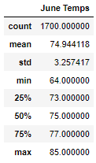
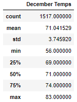
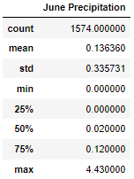
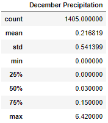

# Surfs Up Challenge Analysis

## Overview of Project
In this challenge, we were tasked with expanding on our previous analysis of weather in Hawaii. Using SQLAlchemy, we were asked to get temperature trends for Jue and December to determine if a surfshop and icecream stand are viable in this location.

## Results
After using a query to create DataFrames for both June and December Temperatures, we found the following to be true:
  - June's was on average 4 degrees hotter than December with a mean of roughly 75&deg;F compared to 71&deg;F
  - December's 3rd quartile was 3 dregrees cooler than June's at 74&deg;F and 77&deg;F respectively
  - December had more outliers with a standard deviation of 3.75 compared to June's which was 3.25
    

    
## Summary
After comparing the analyses, it can be gathered that June and December are not dissimilar in their temperature trends, with June only being a few degrees warmer on average. This dataset included weather readings across several years which increses the reliability of this analysis. With there being a minimal difference in the average temperature at the start of both summer and winter, more analysis should be completed to discover further trends and create a more complete picture before a final decision is reached. Additional queries could instead look at temperatures from February and August instead to see if there is the same relationship between averages at the end of each season. Weekly averages also might offer a clearer picture in temperature trends. Finally, we also ran queries for precipitation trends in both June and December and found that December was slightly wetter than June but not by a significant margin.

